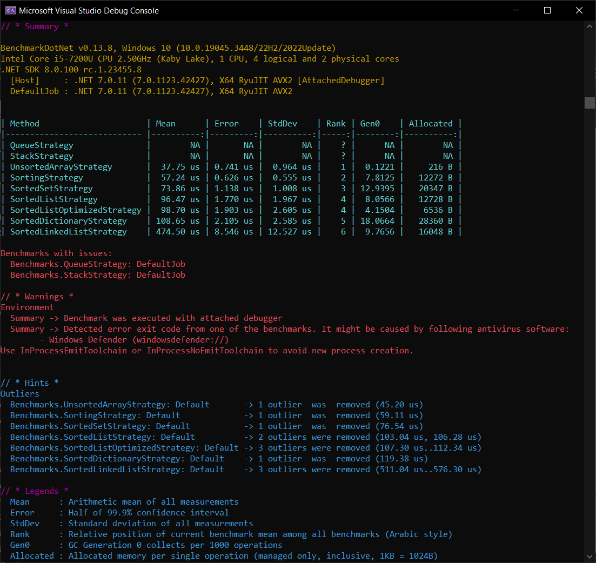

# Introduction

This project demostrates an algorithm written in C# to find the nth largest item in a collection.  Multiple variations of the algorithm were created and benchmarked to find the optimal algorithm.

_(However, I don't think any of these algorithms are optimal, but I didn't look up the correct solution.  I just tried to think of different solutions and benchmarked them for experimentation.)_

# Problem Statement

Using your strongest coding language, please send back a code method that returns the 3rd largest element in a list.

Tips:

_You do not need to implement a sorting algorithm. We encourage you to consider other designs that might be more optimal than sorting, if any. Also, if there are any tradeoffs, please document that in your code._

# Modules

The solution is comprised of 4 main projects and 2 test projects:
1. Algorithms ClientApp is a Console application that hosts BenchmarkDotNet to benchmark different versions of the algorithm.
2. Algorithms Application contains concrete implementations for different versions of the algorithm.
3. Algorithms Data contains test data as well as extension methods to use on collections.
4. Algorithms Domain is where the models are (POCOs).
5. Algorithms Application Tests is a set of unit tests for the Application project.
6. Algorithms Data Tests is a set of unit tests for the Data project.

# Project Structure

```
src\

    LiteBulb.Algorithms.Application (Logic for different algorithms)
    LiteBulb.Algorithms.ClientApp (Console application)
    LiteBulb.Algorithms.Data (Extension methods)
    LiteBulb.Algorithms.Domain (Models)

test\

    LiteBulb.Algorithms.Application.Tests (Unit tests)
    LiteBulb.Algorithms.Data.Tests (Unit tests)
```

# Tech Stack

1. .NET 7.0 (for Console application and libraries)
2. BenchmarkDotNet (for benchmarking)
3. MSTest2 (for unit & integration testing)

_Note: no .NET Standard 2.1 or .NET Standard 2.0._

# Results

| Method                      | Mean      | Error    | StdDev   | Median    | Rank | Gen0    | Allocated |
|---------------------------- |----------:|---------:|---------:|----------:|-----:|--------:|----------:|
| QueueStrategy               |        NA |       NA |       NA |        NA |    ? |      NA |        NA |
| StackStrategy               |        NA |       NA |       NA |        NA |    ? |      NA |        NA |
| UnsortedArrayStrategy       |  38.29 us | 0.701 us | 0.655 us |  38.13 us |    1 |  0.1221 |     216 B |
| SortingStrategy             |  59.01 us | 1.098 us | 2.008 us |  58.21 us |    2 |  7.8125 |   12272 B |
| SortedSetStrategy           |  89.02 us | 1.745 us | 2.818 us |  88.66 us |    3 | 12.9395 |   20347 B |
| SortedListOptimizedStrategy |  97.24 us | 1.867 us | 2.222 us |  96.60 us |    4 |  4.1504 |    6536 B |
| SortedListStrategy          |  99.08 us | 1.965 us | 4.708 us |  96.94 us |    4 |  8.0566 |   12728 B |
| SortedDictionaryStrategy    | 112.49 us | 2.248 us | 6.038 us | 110.51 us |    5 | 18.0664 |   28360 B |
| SortedLinkedListStrategy    | 488.23 us | 5.648 us | 5.007 us | 488.08 us |    6 |  9.7656 |   16048 B |

Note: `QueueStrategy` and `StackStrategy` do not properly work and they do not pass the unit tests.

# Code

```UnsortedArrayStrategy.cs```

```csharp
public class UnsortedArrayStrategy<T> : IStrategy<T> where T : IHasValue, new()
{
    public UnsortedArrayStrategy()
    {
    }

    /// <summary>
    /// Find the nth largest element in the collection.
    /// </summary>
    /// <param name="elements">Collection of Element objects</param>
    /// <param name="n">Represents the desired degree (nth) of largest element in the collection</param>
    /// <returns>Element object which is the nth largest in the collection</returns>
    /// <exception cref="ArgumentNullException"></exception>
    /// <exception cref="ArgumentException"></exception>
    public T Find(IReadOnlyCollection<T> elements, int n)
    {
        ArgumentNullException.ThrowIfNull(elements);

        if (n < 1) { throw new ArgumentException("", nameof(n)); }

        if (elements.Count < n) { throw new ArgumentException($"Collection count cannot be less than requested value of {nameof(n)}.", nameof(elements)); }

        var list = new List<T>();

        int indexOfMinValue;

        foreach (var element in elements)
        {
            if (list.Count < n)
            {
                list.Add(element);
                continue;
            }

            indexOfMinValue = GetIndexOfMinValue(list);

            // If this value is large than the smallest value in the list
            if (element.Value > list[indexOfMinValue].Value)
            {
                // Replace the value at the index of the smallest value
                // (this index might not have the min value anymore after swap)
                list[indexOfMinValue] = element;
            }
        }

        indexOfMinValue = GetIndexOfMinValue(list);

        return list[indexOfMinValue];
    }

    /// <summary>
    /// Linear scan of the array to find the index of the min value O(n).
    /// </summary>
    /// <param name="list">Collection to search</param>
    /// <returns>Index of the minimum value</returns>
    private int GetIndexOfMinValue(IList<T> list)
    {
        int indexOfMinValue = 0;

        // Start at index 1 to skip the initial/default value of indexOfMinValue
        // (n is required to be >= 1)
        for (int i = 1; i < list.Count; i++)
        {
            if (list[i].Value < list[indexOfMinValue].Value)
            {
                indexOfMinValue = i;
            }
        }

        return indexOfMinValue;
    }
}
```

# Screenshots



_Note: See below for links to code repositories._

# GitHub

- [Algorithms Repository](https://github.com/MrJohnB/Algorithms)

# Build and Test

- Build the solution in Visual Studio 2022 and run.
- TODO: Describe and show how to build your code and run the tests.

# BenchmarkDotNet Documentation

[Powerful .NET library for benchmarking](https://github.com/dotnet/BenchmarkDotNet)

# References

If you want to learn more about creating good readme files then refer the following [guidelines](https://docs.microsoft.com/en-us/azure/devops/repos/git/create-a-readme?view=azure-devops). You can also seek inspiration from the below readme files:
- [ASP.NET Core](https://github.com/aspnet/Home)
- [Visual Studio Code](https://github.com/Microsoft/vscode)
- [Chakra Core](https://github.com/Microsoft/ChakraCore)